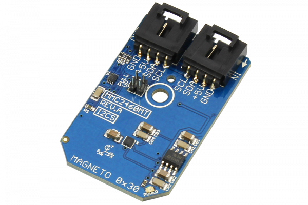

[](https://store.ncd.io/product/mmc2460mt-%C2%B16-gauss-low-noise-2-axis-magnetic-sensor-i2c-mini-module/).

#  MMC2460MT

The MMC2460MT is a 2-axis magnetic sensor with on-chip signal processing. The MMC2460MT can measure magnetic fields within the full scale range of ±6 G with an accuracy of 1°. This device communicates via I2C communications at speeds up to 400kHz.
This Device is available from www.ncd.io 

[SKU: MMC2460MT]

(https://store.ncd.io/product/mmc2460mt-%C2%B16-gauss-low-noise-2-axis-magnetic-sensor-i2c-mini-module/)
This Sample code can be used with Raspberry Pi.

Hardware needed to interface MMC2460MT 2axis accelometer sensor With Raspberry Pi :
1. <a href="https://store.ncd.io/product/mmc2460mt-%C2%B16-gauss-low-noise-2-axis-magnetic-sensor-i2c-mini-module/">MMC2460MT 2axis accelometer sensor</a>
2.  <a href="https://store.ncd.io/product/i2c-shield-for-raspberry-pi-3-pi2-with-outward-facing-i2c-port-terminates-over-hdmi-port/">Raspberry Pi I2C Shield</a>
3. <a href="https://store.ncd.io/product/i%C2%B2c-cable/">I2C Cable</a>

## Python
Download and install smbus library on Raspberry pi. Steps to install smbus are provided at:

https://pypi.python.org/pypi/smbus-cffi/0.5.1

Download (or git pull) the code in pi. Run the program.

```cpp
$> python MMC2460MT.py
```
The lib is a sample library, you will need to calibrate the sensor according to your application requirement.
